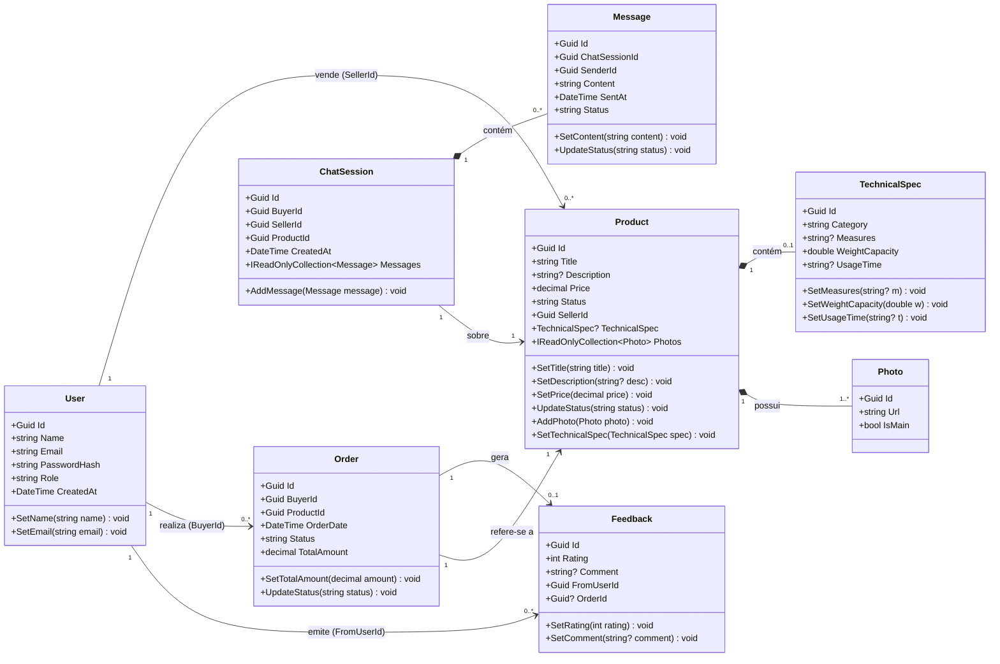

# Diagrama de Classes Refinado – M-TAU

> **TG3 – Deadline 5 | Modelagem Parte II**  
> Refina o diagrama inicial entregue na TG1.2, incorporando métodos de domínio, enumerações, interfaces de repositório e de serviço derivadas da implementação real do código.

---

---

## Notas de Refinamento

| Aspecto | TG1.2 (inicial) | TG3.5 (refinado) |
|---|---|---|
| **Escopo** | Completo com abstracts e enums | Apenas entidades concretas de domínio |
| **Métodos de domínio** | Ausentes | Incluídos em todas as entidades (`SetTitle`, `UpdateStatus`, etc.) |
| **Tipos de dados** | Enums como classes | Simplificados como strings (Category, Status, Role) |
| **Herança** | Todas herdam de EntityBase | Removida; `Id` adicionado explicitamente em cada classe |
| **Relacionamentos** | Associações simples | Composição (`*--`) onde aplicável (Photo/TechnicalSpec pertencem ao Product) |
| **Multiplicidade** | Parcial | Explícita em todas as associações |
