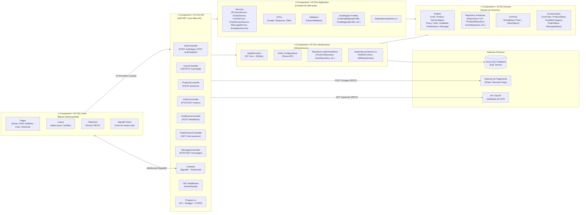
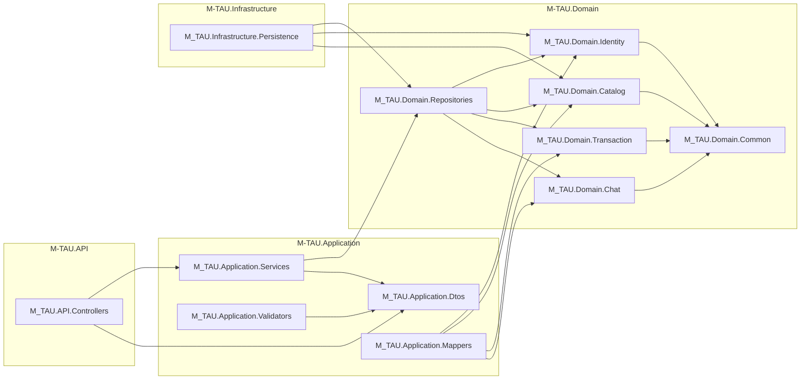

# Diagrama de Componentes – M-TAU

> **TG3 – Deadline 5 | Modelagem Parte II**  
> Representa os componentes de software da solução, suas responsabilidades e as dependências entre eles, mapeando a estrutura real da solução .NET (`M-TAU.sln`).

---

## Visão da Solução (.NET)

---

## Detalhamento das Dependências

| Componente | Depende de | Justificativa |
|---|---|---|
| `M-TAU.Client` | `M-TAU.API` (via HTTP/WS) | SPA Blazor consome endpoints REST e SignalR |
| `M-TAU.API` | `M-TAU.Application` | Controllers delegam lógica para Services |
| `M-TAU.API` | `M-TAU.Infrastructure` | Registra DbContext e repositórios via DI |
| `M-TAU.Application` | `M-TAU.Domain` | Services operam sobre entidades e interfaces de repositório |
| `M-TAU.Infrastructure` | `M-TAU.Domain` | Implementações de repositório dependem das interfaces do domínio |
| `M-TAU.Infrastructure` | Azure SQL | Persistência via EF Core |
| `M-TAU.API` | Gateway de Pagamento | Processamento de transações (RF06) |
| `M-TAU.API` | API ViaCEP | Preenchimento automático de endereço (RF08) |

---

## Diagrama de Pacotes (Package Diagram)

Representa as dependências em nível de namespace dentro de cada projeto.

