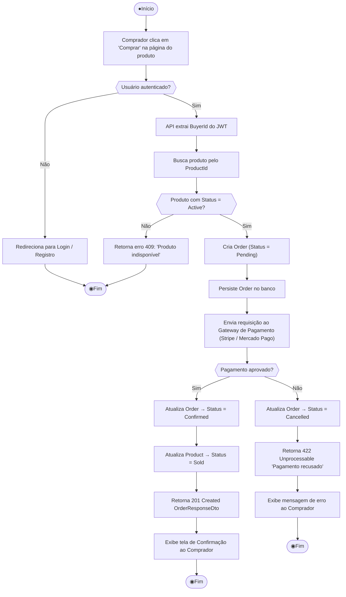
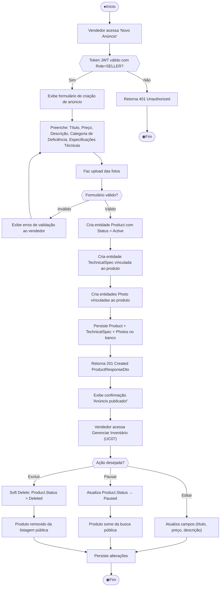
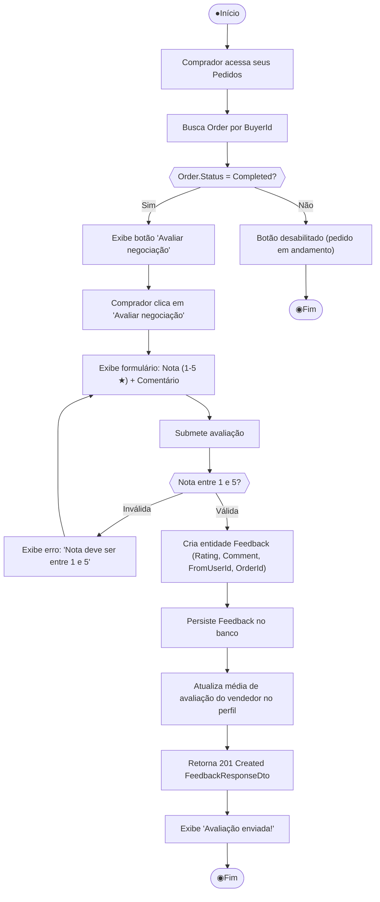

# Diagramas de Atividade – M-TAU

> **TG3 – Deadline 5 | Modelagem Parte II**  
> Diagramas de atividade UML descrevendo o fluxo de controle e decisões dos processos de negócio críticos do sistema.

---

## DA01 – Fluxo de Checkout e Pagamento (UC04 – RF06)

Descreve o processo completo desde a intenção de compra até a confirmação ou falha do pagamento, incluindo as guards de validação de produto e retorno do gateway externo.

---

## DA02 – Fluxo de Publicação de Anúncio (UC02 – RF02 + RF09)

Descreve as atividades de um vendedor ao criar e gerenciar um anúncio de tecnologia assistiva.

---

## DA03 – Fluxo de Avaliação Pós-Negociação (UC06 – RF07)

Descreve o processo de submissão de avaliação, que só é liberado após conclusão do pedido.

