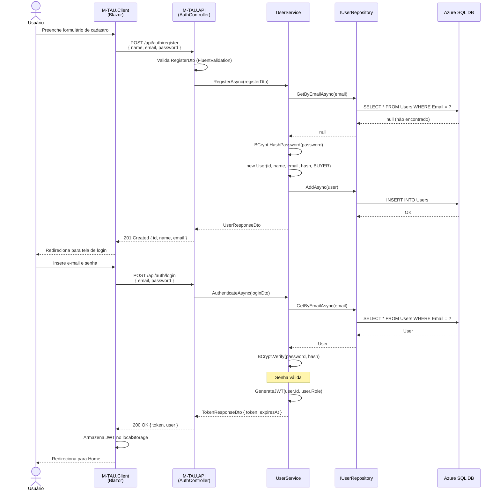
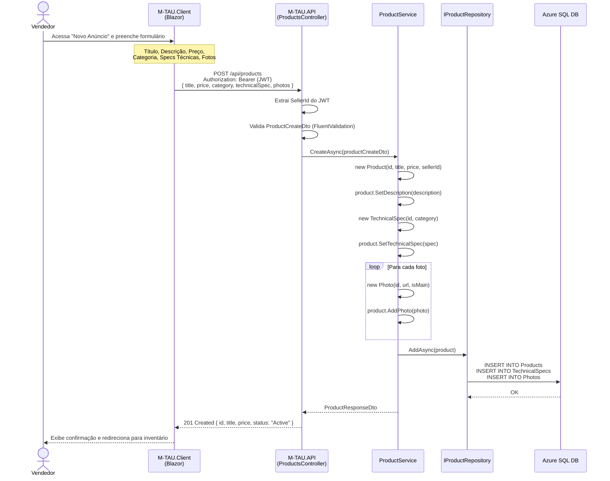
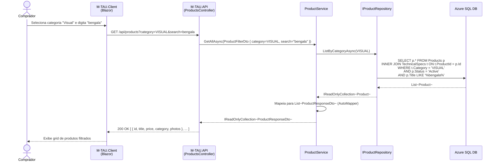
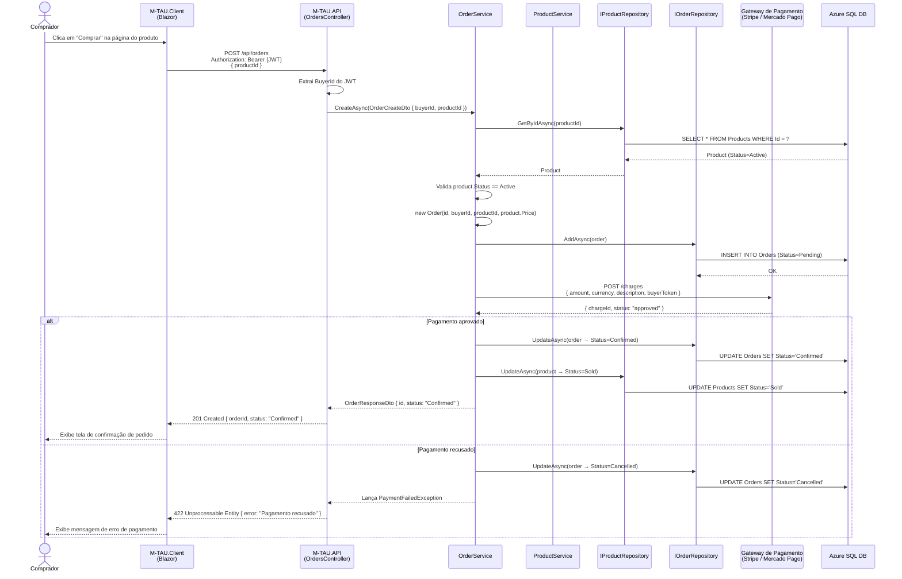

# Diagramas de Sequência – M-TAU

> **TG3 – Deadline 5 | Modelagem Parte II**  
> Diagramas de sequência UML descrevendo os fluxos principais do sistema mapeados aos casos de uso da TG1.2.

---

## DS01 – UC01: Cadastro e Autenticação de Usuário (RF01)

Fluxo de registro de novo usuário seguido de login com emissão de JWT.

---

## DS02 – UC02: Anunciar Tecnologia Assistiva (RF02 + RF04)

Fluxo completo de criação de anúncio por um vendedor autenticado.

---

## DS03 – UC03: Buscar Produtos com Filtros de Deficiência (RF03)

Fluxo de busca pública com filtros especializados.

---

## DS04 – UC04: Realizar Checkout e Pagamento (RF06)

Fluxo de criação de pedido com integração ao gateway de pagamento externo.

---

## DS05 – UC05: Interagir via Chat em Tempo Real (RF05)

Fluxo de criação de sessão de chat e troca de mensagens via SignalR.

```mermaid
sequenceDiagram
    actor Comprador
    actor Vendedor
    participant FE_B as M-TAU.Client<br/>(Comprador)
    participant FE_S as M-TAU.Client<br/>(Vendedor)
    participant API as M-TAU.API<br/>(ChatSessionsController)
    participant Hub as ChatHub<br/>(SignalR)
    participant CSVC as ChatSessionService
    participant MSVC as MessageService
    participant DB as Azure SQL DB

    Comprador->>FE_B: Clica em "Conversar com Vendedor"
    FE_B->>API: POST /api/chat-sessions<br/>Authorization: Bearer {JWT}<br/>{ sellerId, productId }
    API->>CSVC: CreateAsync(ChatSessionCreateDto)
    CSVC->>DB: INSERT INTO ChatSessions (BuyerId, SellerId, ProductId)
    DB-->>CSVC: ChatSession
    CSVC-->>API: ChatSessionResponseDto { sessionId }
    API-->>FE_B: 201 Created { sessionId }

    FE_B->>Hub: Connect (WebSocket)<br/>Joins group: session_{sessionId}
    FE_S->>Hub: Connect (WebSocket)<br/>Joins group: session_{sessionId}

    Comprador->>FE_B: Digita e envia mensagem "Olá, ainda disponível?"
    FE_B->>Hub: SendMessage({ sessionId, content: "Olá..." })
    Hub->>MSVC: SendAsync(MessageCreateDto { sessionId, senderId, content })
    MSVC->>DB: INSERT INTO Messages (Status=Sent)
    DB-->>MSVC: Message
    MSVC-->>Hub: MessageResponseDto
    Hub-->>FE_B: ReceiveMessage({ sender: "Comprador", content, sentAt })
    Hub-->>FE_S: ReceiveMessage({ sender: "Comprador", content, sentAt })
    FE_S-->>Vendedor: Exibe mensagem recebida em tempo real

    Vendedor->>FE_S: Responde "Sim, está disponível!"
    FE_S->>Hub: SendMessage({ sessionId, content: "Sim..." })
    Hub->>MSVC: SendAsync(MessageCreateDto)
    MSVC->>DB: INSERT INTO Messages
    Hub-->>FE_B: ReceiveMessage({ sender: "Vendedor", content, sentAt })
    Hub-->>FE_S: ReceiveMessage({ sender: "Vendedor", content, sentAt })
    FE_B-->>Comprador: Exibe resposta do vendedor
```

